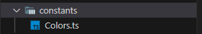
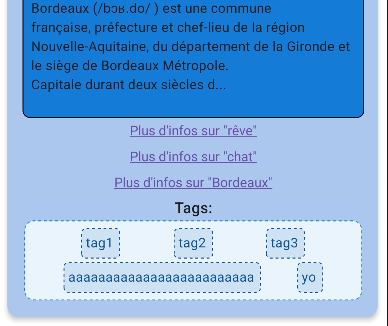
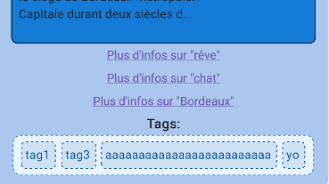

# Dream APP
This is a mobile application for dreams. You can basically register your dreams with various parameters and find the historic of your registered dreams in which there will also be API calls to interpret your dream's content.

## Table of contents
- [Architecture](#architecture)
- [Requirements](#requirements)
- [Installation](#installation)
- - [Meaning Cloud API ?](#how-to-get-your-api-key-on-meaning-cloud)
- [Launch the project](#launch-the-project)
- [Structure](#structure)
- [Implemented functionalities](#implemented-functionalities)
- - [Registering your dream](#registering-your-dream)
- - [Delete your dreams historic](#delete-your-dreams-historic)
- - [Historic of dreams](#historic-of-dreams)
- - [Add a tag](#add-a-tag)
- - [Delete a tag](#delete-a-tag)
- - [Modify the dream](#modify-the-dream)
- - [Search](#search)
- - [Pagination](#pagination)
- - [Delete a dream](#delete-a-dream)
- - [Notifications](#notifications)
- - [Modals](#modals)
- [Issues](#issues)

## Architecture
The application architecture utilizes various technologies including [Javascript](https://devdocs.io/javascript/), [Typescript](https://www.typescriptlang.org/fr/docs/), [React Native](https://reactnative.dev/docs/getting-started), [NextJs](https://nextjs.org/docs), [Expo](https://docs.expo.dev/), [React Native Paper](https://callstack.github.io/react-native-paper/), [Meaning Cloud API](https://www.meaningcloud.com/developer/documentation), and [Wikipedia API](https://www.mediawiki.org/wiki/API:Main_page). 

All the data registered within the app is stored using [AsyncStorage](https://reactnative.dev/docs/asyncstorage). Unlike traditional database systems, AsyncStorage stores data directly on the device, ensuring data persistence. However, it's important to note that the stored data is accessible only on the device where the application is installed and cannot be accessed from other devices. This architecture ensures efficient data management and security while maintaining a lightweight and portable application.

## Requirements
- [Android studio](https://developer.android.com/studio) to test the application on an emulator: **pixel 7 - api 33**.
- [NodeJs](https://nodejs.org/en) to install all required dependencies.
- **Expo Go** app on your physical device to test the application on your own phone.

## Installation

- Clone the project: 
```powershell
git clone https://github.com/SyraxTarg/dreamApp.git [path of your repository]
```
- in a terminal:
```powershell
cd [your repository]
npm install
```
This will install all the required dependencies for the project.

- Create a file `/API_KEY.js` at the root of the project. This file will contain your secret API key for the Meaning Cloud API. Fill the file with the following line and modify it with your own API key:
```javascript
const API_KEY = "your key"
export default API_KEY
```
---
#### How to get your API key on Meaning Cloud ?
- Create an account on [Meaning Cloud's official website](https://www.meaningcloud.com/developer/login).

- - - 

## Launch the project

- To start the project, run this command at the root of your repo:
```powershell 
npx expo
``` 
A QR code and various other things will appear.

- To emulate the project on Android Studio:
  - Launch your device on Android Studio.
  - Press A in the terminal to open the app on the emulator.
- To test the project on your phone:
  - Scan the QR code.
  - Press C if the QR code is not visible anymore on your terminal.

## Structure
- `/constants`: This folder only contains the file `/Colors.ts` which contains color mix that will be used to style our pages.
  - 
- `/components`
  - `/components/_tests_/`: This folder contains everything related to tests.
  - `/components/`: This folder contains all of our TSX components used in pages and also TypeScript files containing functions used either for style or for server.
  - 
- `/assets`
  - `/assets/fonts`: This folder contains the font used throughout the app's pages.
  - `/assets/images`: This folder contains every image used in this project.
  - 
- `/app`
  - `/app/(tabs)`: This folder basically contains the app's pages. `index.tsx` is the first page and `two.tsx` is the second page. `layout.tsx` is the bottom navbar.
  - `/app/`: It contains other pages that are not "principal pages" referenced in the navbar, such as modals or "page not found" page. It also contains web-only files and a file that deals with the layout file in `./(tabs)`.
  - 

## Implemented functionalities
This application is a dream logbook. You are supposed to be able to register your dreams and describe them according to various parameters, you are also supposed to be able to see through your historic of dreams and have a minimum informations about your dreams. 
1. ### Registering your dream
- - -

- As mentioned earlier, you can register a dream by filling a form and submitting it.
- The whole submitting system is encapsulated in the `/components/dreamForm.tsx` component. You can give a title to your dream, a description, memorable elements, persons present in the dream, if it was a lucid dream, if it was a nightmare, and you can also set the date you want by clicking on the "Date" button that will open a modal allowing you to choose a date from a calendar.
- 
- When you click on the submit button, a function is called and makes all the job needed to successfully submit a dream. Please, note that you can't submit an empty dream you have to give at least a description. The function `handleDreamSubmission` creates an object called **newDream** in which the data you filled the form with (title, description, memorable things, ...) will be recorded.
- With the description you provided, an API call will be made. We will use the Meaning Cloud API to search for entities through the text you provided as a description of your dream. The API's response will be then added to the newDream object as the "apiResponse" attribute which is itself an object.
- Then, we will try to search for an array called `dreamFormDataArray` inside our AsyncStorage. If it does not exist, then we create an array called `formDataArray`. When this array is created (if not already), the newDream object will be pushed inside our new `formDataArray` and then this array will be set as "dreamFormDataArray" inside AsyncStorage, as JSON.
- Your new dream is now inside AsyncStorage.
- Also, you will receive a notification whenever you successfully submit a dream. **/!\ Important: notifications only work on physical device not on emulated device**

2. ### Delete your dreams historic
- You can delete every single dream you previously registered by clicking on the button "effacer l'historique" on the bottom of the page. This will delete everything that was put in the AsyncStorage. you may need to reload the app to actually see it work.

3. ### Historic of Dreams
- Once you have dreams, you can go on the second page, the historic page, to see your past dreams.
-  
- This section lists all the dreams that have been recorded and are stored in AsyncStorage. Each dream is displayed as a "dream card" showing all available information about that dream. This page refers to `/tabs/two.tsx` and the dream card component `/components/dreamCard.tsx`.
- As you can see, additional information has been added to the dream card. This information is actually the result of two API calls. The first call, made when submitting a new dream, searches for words representing entities in the description text. Then, the second API call, made when viewing the historic page, fetches information using the Wikipedia API. Essentially, the first call retrieves the detected words, and with these words, we fetch data from Wikipedia. Thus, additional information is displayed on your dream card if the first API detected anything in your dream description. Additionally, at the bottom of the information, you have "Plus d'infos sur ..." links that redirect to the Wikipedia page of the entity when clicked.
- When you click on a dream card, several options are available: you can add a tag, delete a tag, or modify the dream.
- 
4. ### Add a tag
- When you click on "add a tag" (ajouter un tag) a new dialog shows up.
- 
- This dialog allows you to enter a tag name that will be given to your dream. You can give a dream as many tags as you want; they will all be displayed at the bottom of the card.
- 
5. ### Delete a tag
- If you click on "delete a tag" (supprimer un tag) a new dialog shows up.
- 
- This dialog displays all the tags of the dream. To delete them, you just have to click on the name of the tag you want to delete. 
- 
- Here I deleted "tag2", as you can see it is not on the dream card anymore.
6. ### Modify the dream
- If you click on modify the dream (modifier ce rêve), a new dialog will show up.
- 
- This dialog shows you the same kind of form that you used to register your dream. However, this time all the inputs will be pre-filled with the data you already put in this dream (if you actually put data in some inputs). In the dream card example I have been using, I put data everywhere and made it a lucid dream and a nightmare. If I want I can decide that this dream was, in fact not a nightmare, I just have to un-switch the nightmare switch. It works the same with everything in this form, I can modify my dream however I want. 
-  
- As you can see, the information about my dream also changed. To actually have the new information showing up, **you need to reload the app**.

7. ### Search
- Here I added more (meaningless) dreams and gave them different tags. If I use the search bar on top of the page, I can search for a dream by its tags.
- 
- You can also search by title and by date. If nothing is found, your search will only find a "no result".
- 

8. ### Pagination
- A page will only show the 5 newest dreams, if you have more than that, your latest dreams will be displaced to another page. For example, if you are on page 1 they will be displaced on page 2. You can access this page by clicking "Suivant" at the bottom of the current page. You can come back by clicking "Précédent", at the same place.

9. ### Delete a dream
- If you long-click a dream, a new dialog will show up.
- 
- If you click on "supprimer le rêve", the dream you clicked on will be deleted.

10. ### Notifications
- **The notification system does not work on emulator. it only works on physical devices**
- A notification will be sent every time a dream has successfully been registered.
- A notification will send 1 hour after the last dream registered.

- ### Modals:
- On both pages (form page and historic page), you will find little ℹ️. By clicking on them, you fill open modals that will tell you what to do with the page you are currently on.

## Issues
Here are listed all the known issues and their solutions:

- Information not updating when modifying the description of a dream => reload the application (press R on your terminal)
- Information being all mixed up when adding a new dream => reload the application (press R on your terminal)

If you have other issues, try to reload the application.
